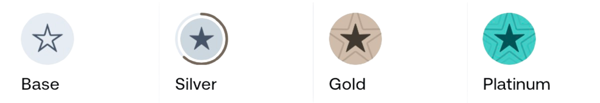

# Fee Schedule

## Transparent and Fair Pricing

AssetSwap operates on a performance-based fee structure that rewards active traders and loyal token holders. Our transparent pricing ensures you always know exactly what you're paying, with opportunities to significantly reduce fees through increased activity or A7X token holdings.

## Understanding Our Fee Structure

### Base Trading Fees

Every trade on AssetSwap incurs a trading fee that covers platform operations, liquidity access, AI computational resources, and continuous development. New users begin with our standard rate of 2.5% per transaction, which is competitive within the DeFi ecosystem while ensuring sustainable platform growth.

### How Fees Are Calculated

Trading fees apply to the total transaction value at the time of execution. For example, when you swap $1,000 worth of tokens, a 2.5% fee equals $25. This fee is automatically deducted from your transaction, so you always receive the net amount after fees. The platform displays exact fee amounts before you confirm any trade, ensuring complete transparency.

## AssetSwap Loyalty Program

### Tier Qualification System

Our loyalty program recognizes and rewards platform engagement through two independent qualification paths. You can achieve higher tiers and lower fees by either increasing your trading volume or holding A7X tokens. This dual-path system ensures both active traders and long-term believers benefit from reduced fees.

<figure><figcaption></figcaption></figure>

### Volume-Based Qualification

Your 30-day rolling trading volume automatically determines your tier eligibility. The system calculates your total swap value over the past 30 days, updating daily. This means consistent trading activity maintains your tier status, while increased activity can upgrade your tier immediately upon reaching thresholds.

### A7X Holdings Qualification

Alternatively, maintain a percentage of your portfolio in A7X tokens to qualify for reduced fees. This percentage is calculated as the USD value of your A7X holdings divided by your total portfolio value. Token holders enjoy tier benefits regardless of trading frequency, making this ideal for long-term investors.

## Loyalty Tier Benefits

### Complete Tier Structure

| Tier         | 30-Day Volume | % of A7X Holdings | Trading Fee | Perks                                             |
| ------------ | ------------- | ----------------- | ----------- | ------------------------------------------------- |
| **Base**     | < $10,000     | < 2%              | **2.50%**   | Standard speed, basic data                        |
| **Silver**   | > $10,000     | 2% – 8%           | **1.80%**   | Faster models, premium data points, copy trading  |
| **Gold**     | > $100,000    | 8% – 15%          | **1.40%**   | Same as Silver, with higher model priority        |
| **Platinum** | > $1,000,000  | > 15%             | **0.80%**   | Fastest execution, full data access, copy trading |

**Important:** You only need to meet one condition (either volume OR holdings) to qualify for any tier.

### Tier Perks Explained

Beyond fee reductions, each tier unlocks exclusive platform features:

**Base Tier** provides essential trading functionality with standard AI assistance and market data access. Perfect for beginners exploring the platform.

**Silver Tier** unlocks faster AI model responses, reducing wait times for complex queries. Access premium data points including advanced metrics and copy trading features to follow successful traders.

**Gold Tier** enhances Silver benefits with priority processing during high-traffic periods. Your trades and queries receive preferential handling, ensuring smooth operations even during market volatility.

**Platinum Tier** offers the ultimate trading experience with near-instant AI responses, comprehensive data access, and priority support. Platinum traders shape platform development through exclusive feedback channels.

## Fee Calculation Examples

### Real-World Scenarios

Understanding how tier benefits translate to actual savings helps optimize your trading strategy:

**Scenario 1: The Token Holder**
Sarah holds $10,000 in various tokens with $1,500 (15%) in A7X. Despite only trading $2,000 last month, she qualifies for Platinum tier. On a $5,000 swap, she pays just $40 in fees (0.8%) instead of $125 (2.5%), saving $85 per trade.

**Scenario 2: The Active Trader**
Mike doesn't hold A7X but trades actively, reaching $150,000 volume in 30 days. His Gold tier status reduces fees to 1.4%. On his typical $10,000 daily trades, he saves $110 per day compared to base tier fees.

**Scenario 3: The Balanced Approach**
Lisa maintains 5% A7X holdings and trades $15,000 monthly. Either metric qualifies her for Silver tier at 1.8% fees. She saves $35 on every $5,000 trade while supporting the ecosystem.

## Additional Fee Information

### No Hidden Costs

AssetSwap maintains complete fee transparency with no hidden charges:

- **No deposit fees** - Add funds without platform charges
- **No withdrawal fees** - Remove assets freely
- **No account fees** - No monthly or annual charges
- **No inactivity fees** - Your account remains free regardless of usage

### Network Fees

While AssetSwap doesn't charge additional network fees, standard blockchain gas fees apply to on-chain transactions. These fees go directly to network validators, not AssetSwap. The platform optimizes transactions to minimize gas costs whenever possible.

### Fee Distribution

Trading fees support ecosystem sustainability:
- Platform operations and development (40%)
- Liquidity provision and market making (30%)
- AI infrastructure and improvements (20%)
- Community rewards and incentives (10%)

## Maximizing Your Benefits

### Strategic Tier Optimization

Consider these strategies to reduce your trading costs:

**For Occasional Traders:** Accumulate A7X tokens during market dips to maintain tier status without high-volume trading. Even small holdings can unlock significant fee reductions.

**For Active Traders:** Focus on consistent daily trading rather than sporadic large trades. Spreading volume across the month maintains tier status more reliably.

**For Investors:** Combine moderate A7X holdings with regular trading to achieve higher tiers through dual qualification. This balanced approach provides flexibility and reduced fees.

### Tracking Your Status

Monitor your tier status in real-time through the dashboard. The platform displays your current tier, progress toward the next level, and estimated savings. Set alerts for tier changes to optimize your trading strategy.

## Frequently Asked Questions

### When do tier changes take effect?

Tier upgrades apply immediately upon qualification. Downgrades occur at the start of the following day if you no longer meet requirements.

### Can I prepay fees for additional discounts?

Currently, fees are deducted per transaction. We're exploring subscription models for frequent traders.

### Do referral rewards count toward trading volume?

Yes, trades made by your referrals contribute to your 30-day volume calculation.

### How often are A7X holdings calculated?

The system checks your A7X percentage every hour, using the average over 24 hours to determine tier eligibility.
